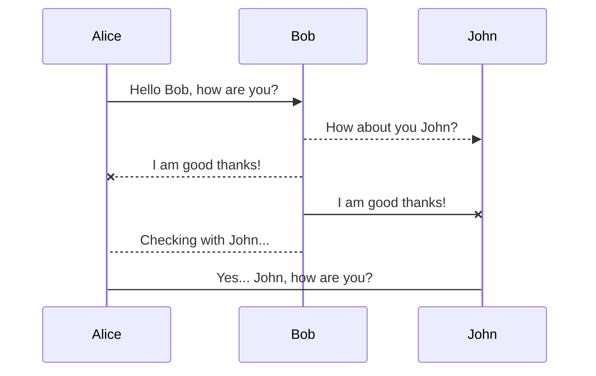

sequenceDiagram
    Alice ->> Bob: Hello Bob, how are you?
    Bob-->>John: How about you John?
    Bob--x Alice: I am good thanks!
    Bob-x John: I am good thanks!
    Note right of John: Bob thinks a long long time, so long that the text does not fit on a row.

    Bob-->Alice: Checking with John...
    Alice->John: Yes... John, how are you?
    John-->Telis: Hello

gantt
    title A Gantt Diagram

    section Section
    A task           :t1, 2016-01-01, 30d
    Another task     :after t1  , 20d
    section Another
    Task in sec      :2016-02-12  , 6d
    anther task      : 24d

